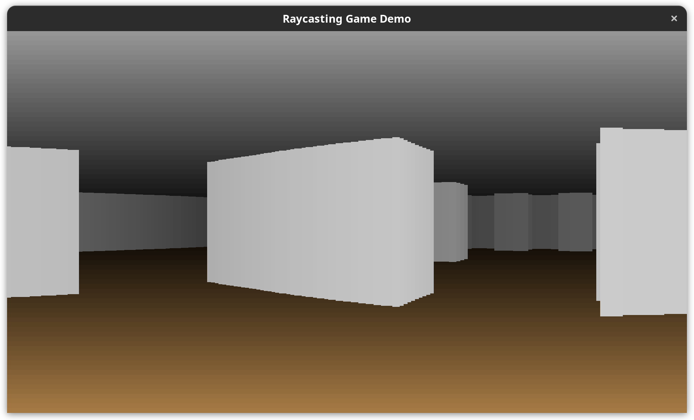

# raycasting-game-demo
My attempt at a basic 2d game demo using [ray casting](https://en.wikipedia.org/wiki/Ray_casting). Written completely in rust using the [macroquad](https://github.com/not-fl3/macroquad) game library.

## Building
Building on Windows does not require any additional dependencies. However, if you are building on Linux, follow [these instructions for building the macroquad library](https://github.com/not-fl3/macroquad#linux).

## Gameplay
Currently, the game only supports player movement around a pre-built map. You can walk around using the "WASD" keys and can look around using the left and right arrow keys.

